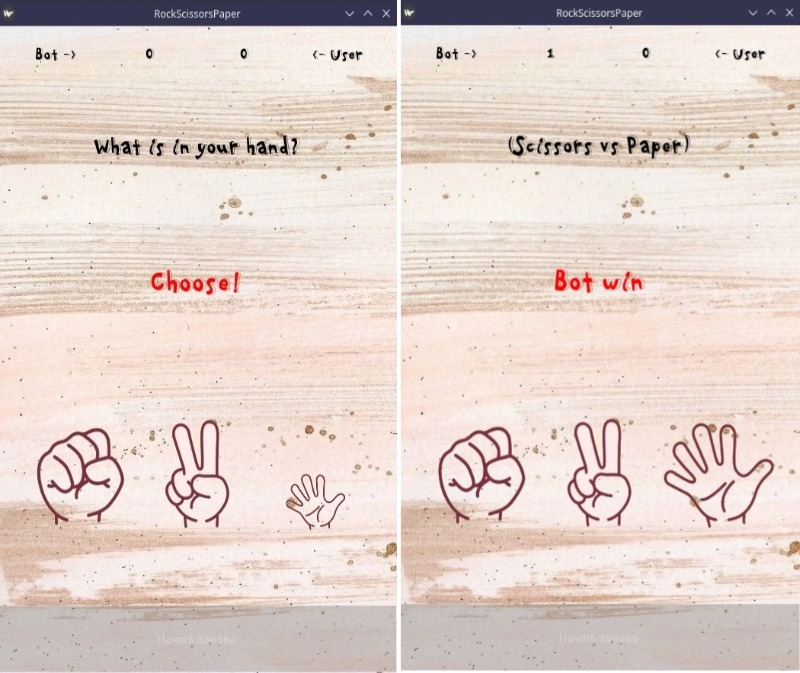
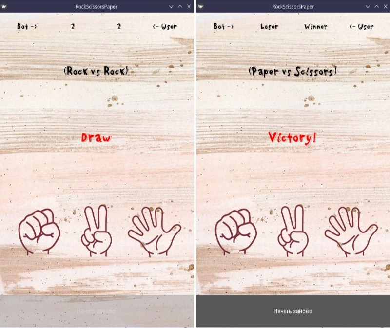

      

      

## About
This program creates a simple game where the objective is to click a one of the buttons to increase your score. The score is displayed using a label widget.
In this game User plays against a Bot and the Winner is the one who won five times first.
The **RockScissorsPaper** game is created using the Kivy framework and can be run on **Android devices**.

## Installation

1. Clone the repository: 

>*git clone https://github.com/IamSonic17/Mobile-game.git*

2. Install the required dependencies by running: 

>*pip install requirements.txt*

3. Run the app using:

>*python main.py*

## Important
You can use mobile IDEs to use the app on mobile devices. To do this, install the IDE (Pydroid 3 or similar) and the project files on your mobile device.

 Also, you can compile this project files in APK (Android Application Package) and run it without IDE.

## Developers

- [Ilya Borisov](https://github.com/IamSonic17)